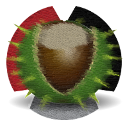

#### MAY 10th, 2019 - v0.1.3 Released

- Platform detection fixed for Linux systems that returns "Linux2"
- Fixed encryption command to avoid anomalies that causes failed output
- Fixed decryption command and subprocess to avaid anomalies that causes failed output
- Added short-cut button to use ~/.ssh/id_rsa without searching for it

#### OCT 23th, 2018 - v0.1.2 Released

- UI Fixes and Visual Cues
- macOS .app
- Windows 10 .exe
- Linux Install Script installs ssh-vault to /usr/bin instead
- Determines OS platform and puts the right full-path to ssh-vault on command execution to prevent env issues with launching with applications menu

#### OCT 21th, 2018 - v0.1.1 Released

- Hotfix - Installation Script Fixed
- Hotfix - Interpreter for future cross platform support
- Hotfix - .desktop fix

#### OCT 21th, 2018 - v0.1.0 Released

- Birth of SSHshare