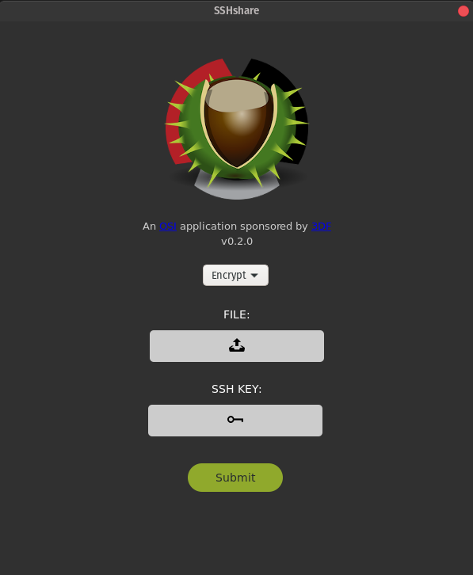

# SSHshare v0.2.0
**maintained by:** hkdb \<<hkdb@3df.io>\><br />


## Description
---
A Cross-Platform Graphical Desktop Application (wrapper) written in Go, Javascript, and HTML5 that simplifies encrypting and decrypting files with [ssh-vault](https://ssh-vault.com).

## Concept
---
A while back, I discovered this awesome piece of software called [ssh-vault](https://ssh-vault.com) that allows you to encrypt and decrypt text, photos, and pdf files with ssh keys. I found this to be the most user friendly (NON-CLOUD) way to share passwords and sensitive documents between my team members. However, as technical as some of my team members are, not all of them are comfortable with CLI so I decided to whip this GUI front-end up so that they are more comfortable with using this solution to share information securely.

### WHy SSH Keys?

Because most technical staff and more and more so even non-technical ones have a ssh key pair already for accessing cloud resources and such. Leveraging what's already there to encrypt and decrypt information shared among team members is a much better solution than to ask everyone to adopt yet another tech (ie. GPG, etc) to accomplish what can already be done with the existing encryption toolbox.

### From Python to Go

This was originally written in Python and GTK3 which is great when running on Linux and Mac but not so much for Windows. I wanted something that was truly cross platform and easy to distribute so I ended up with HTML/JS (UI) and [Go](https://golang.org) (logic) with [zserge/webview](https://github.com/zserge/webview) (go/webview infrastructure and 2-way bindings), [sqweek/dialog](https://github.com/sqweek/dialog) (cross-platform native dialogs), and [skratchdot/open-golang](https://github.com/skratchdot/open-golang) (open resources with default applications across Win/Lin/Mac).

## Change Log
---

#### May 31st, 2020 - v0.2.0 Released

- Rewritten in Go/JS/HTML
- Removed restrictions of only processsing text files as ssh-vault supports pretty much all formats
- Compiled and tested on 64-bit Pop! OS 20.04, MacOS (High Sierra, Mojave, Catalina), and Windows 10

#### Before May 31st, 2020

[Legacy Change Log](LegacyCL.md) for the Python GTK3 version of this App

## Screenshots
---


## Under the Hood
---
It essentially takes your GUI input and turn them into the following ssh-vault commands based on the user selection of encrypt or decrypt:

Encrypt ~

```
ssh-vault -k [/full_path/ssh_public_key_file] create < [/full_path/input] [input].ssh
```
Decrypt ~

```
ssh-vault -k [/full_path/ssh_private_key_file] -o [/full_path/input].txt view [input].ssh
```

## Expected Behavior

Persona A:  
- `private` - a_id_rsa
- `public` - a_id_rsa.pub

Persona B:
- `private` - b_id_rsa
- `public` - b_id_rsa.pub

Scenario: `A` sends an encrypted file named `presentation.pdf` to `B`
1. B sends his/her public key (`b_id_rsa.pub`) to A by e-mail or a messenger of choice
2. A selects (`presentation.pdf`) and `b_id_rsa.pub` on SSHshare to encrypt the file
3. A will find a new file named `presentation.pdf.ssh` located in the same directory as `presentation.pdf`
4. A sends presentation.pdf.ssh to B via e-mail or some sort of messenger of choice
5. B receives `presentation.pdf.ssh` from A and saves it ot his/her local harddrive
6. B decrypts `presentation.pdf.ssh` by selecting it on SSHshare and his own private key (`b_id_rsa`)
7. B will find a new file named `presenation.pdf` in the same directory where `presentation.pdf.ssh` is located
8. B can now read the presentation sent from A securely

## Error Handling
---

Currently, if any of the below conditions are met, the application will either automatically handle or show an error/warning dialog message that returns to the main window without doing anything upon the user clicking "OK". This is designed to prevent any dangerous execution of ssh-vault.

Shows an Error Dialog Message and Returns to Main Window Upon the User Clicking "OK":

- Input file is not specified
- SSH Key is not specified
- Input File Name Contains Unsupported Characters(\`)
- Encrypt is selected but the input file has a .ssh extension
- Decrypt is selected but the input file does not have a .ssh extension
- Encrypt is selected but private key is specified
- Decrypt is selected but public key is specified
- When user tries to drag and drop files (`Until Drag and Drop is implemented`)
- Output file in the same location as the input file exists

## Installation & Development
---

### [Linux](linux/README.md)
### [macOS](macos/README.md)
### [Win10](win/README.md)


## Future Plans
---

- Drag and Drop of Files into Application for File Selection
- Generate ssh keys
- Shortcut to your own private or public key
- Server Implementation to make team sharing more efficient


## Disclaimer
---
This application is maintained by volunteers and in no way do the maintainers make any guarantees. Please use at your own risk!

## Recognition
---
Shout out to the people at [ssh-vault](https://github.com/ssh-vault) for making an awesome way to handle secure sharing!

This is an application utility sponsored by 3DF Limited's Open Source Initiative.

To Learn more please visit:

https://osi.3df.io

https://3df.io
