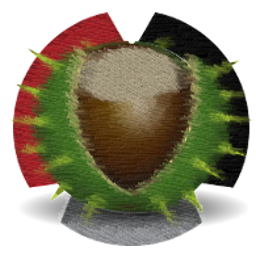

# Windows 10 64-bit

maintained by: hkdb `<hkdb@3df.io>`



### Dependancies:

- OpenSSH
- ssh-vault
- [Scoop](https://scoop.sh)
    - wget
    - gcc (Development Only)
    - Go (Development Only)
    - zip (Development Only)
    - unzip (Development Only)
- [Windows 10 SDK](https://developer.microsoft.com/en-US/windows/downloads/windows-10-sdk/) (Development Only)

### Delta:

- ssh-vault will be included in the release zip

- ssh-vault will be installed at C:\Users\<username>\AppData\Local\Microsoft\WindowsApps

- The two DLL files must be in the same directory as the compiled exe for it to run properly.

- SSHshare will be installed in C:\Users\<username>\AppData\Local\Programs\SSHshare\

- A desktop shortcut will be automatically made.

### Compiling:

Execute the following if you are compiling for the first time:

Open Powershell as Administrator:
```
PS C:\WINDOWS\system32> CheckNetIsolation.exe LoopbackExempt -a -n="Microsoft.Win32WebViewHost_cw5n1h2txyewy"
```
Note: This is to allow hosting a webserver on localhost which is the backend of the application

From the cloned repo:

```
go get
go get github.com/akavel/rsrc
go get github.com/josephspurrier/goversioninfo/cmd/goversioninfo
```

If it doesn't work, you may need to do the following:
```
go get -u github.com/zserge/webview
```
Execute the following scripts starting at the top level of the repo:

```
.\build.bat
```

### Distribution:

Package zip for release starting from top level of repo:

```
# Change version number in version.info first
.\build.bat
cd win
.\dist.bat -v <version>
```
Now you should have win/SSHshare-`<version>`-x64-win10.zip ready for distribution

### Installation:

1. Download the zip archive: SSH-v<version>-x64-win10.zip

2. Unzip SSHshare-<version>-x64-win10.zip
   
3. Open Powershell as Administrator:
   ```
   PS C:\WINDOWS\system32> CheckNetIsolation.exe LoopbackExempt -a -n="Microsoft.Win32WebViewHost_cw5n1h2txyewy"
   ```
   Note: This is to allow hosting a webserver on localhost which is the backend of the application

4. Open up the unzipped folder and double click on "install.bat"

5. You now have successfully installed SSHshare for Windows and a new shortcut on your desktop to launch the app